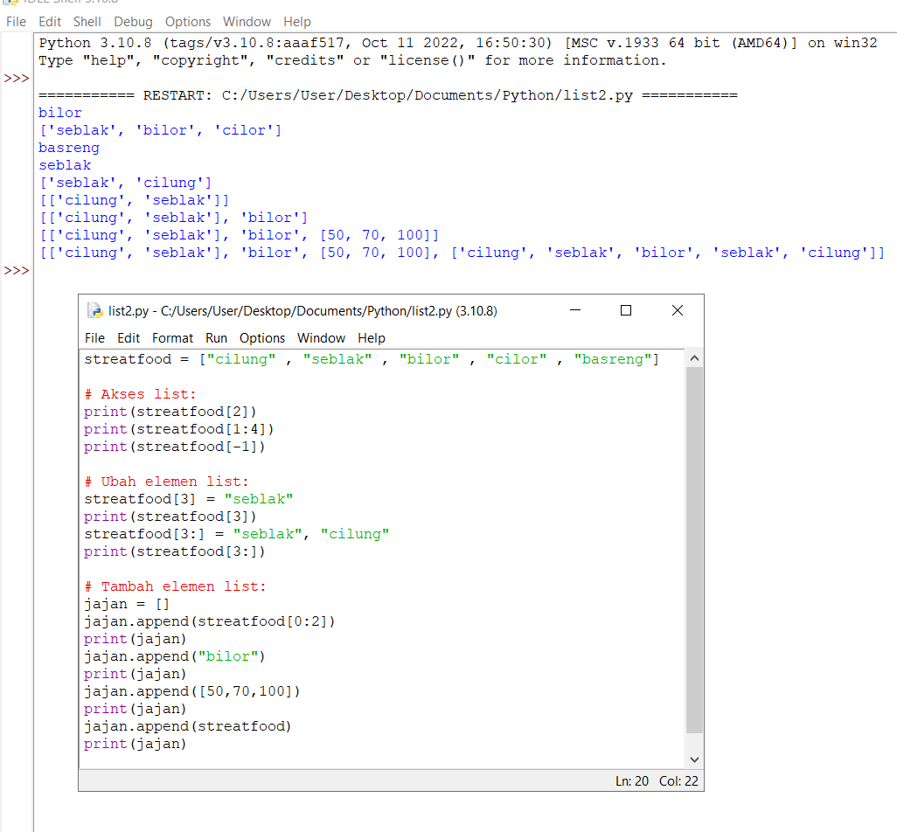
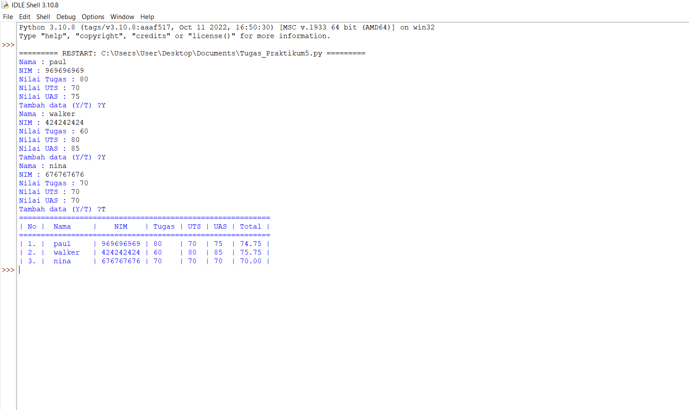

# Praktikum5 
## Latihan 5
### Cara membuat sebuah list sebanyak 5 elemen dengan nilai bebas
```
#### Akses list:
- Tampilkan elemen ke - 3
- Ambil nilai elemen ke - 2 sampai elemen ke - 4
- Ambil elemen terakhir 
```
```
### Ubah elemen list:
- Ubah elemen ke - 4 dengan nilai lainnya
- Ubah elemen ke - 4 dengan elemen terakhir 
```
```
#### Tambah elemen list:
- Ambil 2 bagian dari list pertama (A) dan jadikan list ke -2 (B)
- Tambah list B dengan nilai string
- Tambah list B dengan 3 nilai
- Gabungkan list B dengan list A 
```

## Tugas Praktikum 5
#### Langkah-langkah
- Pertama, buat lah list yang sudah ditentukan :
```
NAMA = []
NIM = []
Tugas = []
UTS = []
UAS = []
Total = []
```
- lalu buat program untuk menggabungkan list variable yang sudah kita buat diatas berikut:
```
while True:
    nama = input('Nama : ')
    NAMA.append(nama)
    nim = int(input('NIM : '))
    NIM.append(nim)
    nTugas = float(input('Nilai Tugas : '))
    Tugas.append(nTugas)
    uts = float(input('Nilai UTS : '))
    UTS.append(uts)
    uas = float(input('Nilai UAS : '))
    UAS.append(uas)
    nAkhir = (int(nTugas) * .3) + (int(uts) * .35) + (int(uas) * .35)
    Total.append(nAkhir)
```
- Membuat program pilihan (Y/T)?, dimana Y digunakan untuk mengiput data, setelah itu kita akan diminta untuk mengisi data kembali. T digunakan untuk mengakhiri program dan menampilkan hasil inputan data yang telah kita buat
- Lalu masukan program untuk membuat tabel menggunakan peformatan string agar terlihat rapi
```
lagi = ''
    while lagi != 'Y' and lagi != 'T':
        lagi = input('Tambah data (Y/T) ?')
    if lagi == 'T':
        print('='*58)
        print('| No | \tNama\t |    NIM    | Tugas | UTS | UAS | Total |')
        print('='*58)        
        for i in range (len(NIM)):
            nm = '| %d. | \t%s\t' % (i+1, NAMA[i])
            im = ' | %d' % NIM[i]
            tg = ' | %d' % Tugas[i]
            ut = '    | %d' % UTS[i]
            us = '  | %d' % UAS[i]
            ak = '  | %.2f' % Total[i]
            ov = ' |'
            overall = nm + im + tg + ut + us + ak + ov
            print(overall)

        break
```
### Tampilan Program


